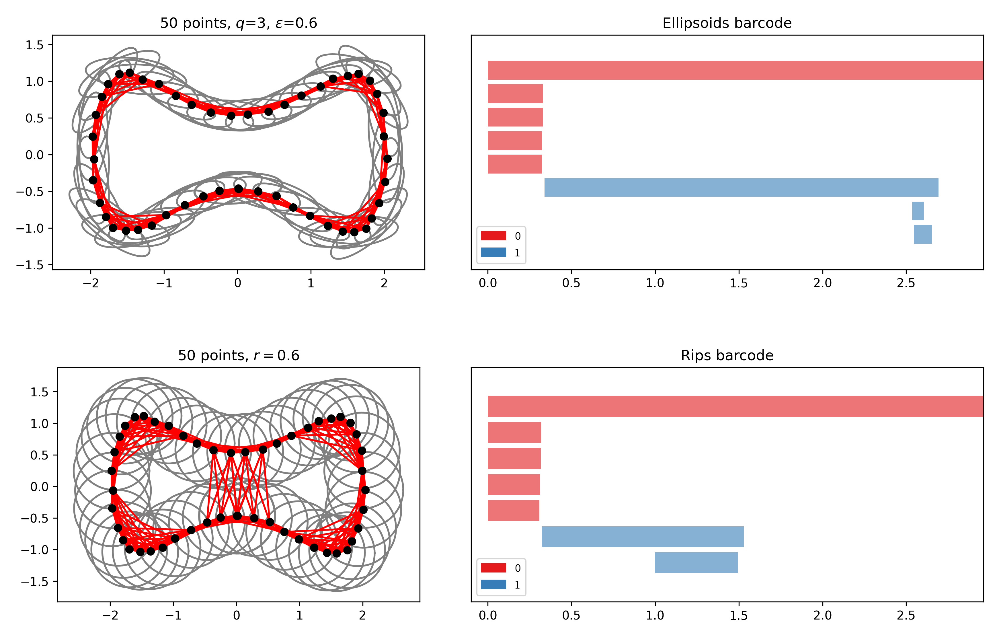

  <h1 align="center">Ellipsoids</h3>

  

    Persistence homology of ellipsoid complexes
  

<!-- TABLE OF CONTENTS -->

  
Table of Contents

  <ol>
    <li><a href="#about-the-project">About The Project</a></li>
    <li><a href="#getting-started">Getting Started</a>
      <ul>
        <li><a href="#prerequisites">Prerequisites</a></li>
        <li><a href="#installation">Installation</a></li>
      </ul>
    </li>
    <li><a href="#usage">Usage and code organisation</a></li>
    <li><a href="#acknowledgments">Acknowledgments</a></li>
  </ol>

# About the project

This project contains the code used in the paper "Persistent Homology via Ellipsoids" [[1]](#1).

In the paper, we introduce a geometrically-informed simplicial complex, called the "ellipsoid complex". This complex is based on the idea that ellipsoids aligned with tangent directions better approximate the data compared to conventional (Euclidean) balls centered at sample points that are used in the construction of Rips and Alpha complexes, for instance.

The main goal of the project is to investigate properties of the ellipsoid complexes.

This repository contains modules for the generation of ellipsoid complexes, calculation of the corresponding barcodes, visualisation, as well as scripts for running various experiments. For more details on the code organisation, see the section on <a href="#usage">usage and code organisation</a> below.

# Getting started

At the moment, this code is only available on GitHub, at [https://github.com/a-zeg/ellipsoids](https://github.com/a-zeg/ellipsoids).

To run a simple example that will generate the image from the start of this README:
1. install the <a href="#prerequisites">prerequisites</a>;
2. download the project as a zip file from GitHub and unzip it;
3. navigate to the project root folder;
4. run the script `scripts/simple_example.py`.

## Prerequisites

The dependencies are listed in [requirements.txt](./requirements.txt).

## Installation

Currently, the project can only be cloned or downloaded directly from GitHub; it is not available for installation via a package manager.

# Usage and code organisation

All the scripts need to be run from the project root directory (so `ellipsoids/` and not e.g. `ellipsoids/ellipsoids/` or `ellipsoids/scripts/`).

Below is an overview of the project folders.

| Folder | Description |
| -------- | ------- |
| `data/` | Default output location for various scripts. |
| `datasets/` | Datasets, including pentagons and cyclo-octane. |
| `ellipsoids/` | Modules for: generating ellipsoid complexes and calculating barcodes, visualisation, handling data, and running classification experiments developed in [2]. |
| `images/` | Images for this README. |
| `scripts/` | Scripts that run various experiments, some of which are used in [1]. |

Warning: this is the first draft of the code. Not all scripts have been tested and some may be outdated.

# Acknowledgements

The last co-author of the paper [[1]](#1) would like to thank:
- Marco Gähler for running the Code Review Days at ETH Zurich, for taking the time to read through an earlier version of the code, and for his tips on testing and improving code readability.
- Jan Schüssler for his help with parallelisation and Python paths.

The paper in its current form would not be possible without the following papers, libraries, and datasets.

- Theoretical results from the work of Kališnik and Lešnik [[2]](#2) were the inspiration for this project.
- [GUDHI Library](https://gudhi.inria.fr/index.html) is used throughout the project. The function `plot_barcode` in `visualisation.py` is an adapted version the function `plot_persistence_barcode` from [this file](https://gudhi.inria.fr/python/latest/_modules/gudhi/persistence_graphical_tools.html#plot_persistence_barcode).
- The code in `ellipsoids/turkevs` was borrowed (with small modifications) from [https://github.com/renata-turkes/turkevs2022on](https://github.com/renata-turkes/turkevs2022on).
- The cyclo-octane dataset was obtained from the JavaPlex library in MATLAB.
- The pentagons dataset was created by Clayton Shonkwiler and provided to us by Henry Adams.
- The function `create_annulus` in `data_handling.py` was borrowed from [pytorch-topological](https://github.com/aidos-lab/pytorch-topological/blob/main/torch_topological/data/shapes.py).

# References

<a id="1">[1]</a> 
S. Kališnik, B. Rieck and A. Žegarac.
"Persistent Homology via Ellipsoids".

<a id="2">[2]</a>
S. Kališnik and D. Lešnik. 
"Finding the homology of manifolds using ellipsoids". 
In: Journal of Applied and Computational Topology 8.1 (Mar. 2024), pp. 193–238. doi: 10.1007/s41468-023- 00145-6.

<a id="3">[3]</a> 
R.Turkeš, G.F.Montúfar, and N.Otter. 
"On the Effectiveness of Persistent Homology”. 
In: Advances in Neural Information Processing Systems. Ed. by S. Koyejo et al. Vol. 35. Curran Associates, Inc., 2022, pp. 35432–35448.