<div align="center">

  <h1 align="center">Ellipsoids project</h3>

  <p align="center">
    Calculate persistence homology of ellipsoid complexes.
  </p>
</div>


<!-- TABLE OF CONTENTS -->
<details>
  <summary>Table of Contents</summary>
  <ol>
    <li><a href="#about-the-project">About The Project</a></li>
    <li><a href="#getting-started">Getting Started</a>
      <ul>
        <li><a href="#prerequisites">Prerequisites</a></li>
        <li><a href="#installation">Installation</a></li>
      </ul>
    </li>
    <li><a href="#usage">Usage</a></li>
       <ul>
        <li><a href="#user-input">User input</a></li>
        <li><a href="#output">Output</a></li>
      </ul>
    <li><a href="#roadmap">Roadmap</a></li>
    <li><a href="#acknowledgments">Acknowledgments</a></li>
  </ol>
</details>

# About the project


The main goal of this project is to investigate properties of ellipsoid complexes. Ellipsoid complexes are Rips-like complexes created by considering ellipsoids centered at the data points (as opposed to balls in the case of Rips complexes).

This software generates ellipsoid complexes from the given point cloud data and calculates barcodes of their persistent homology.

# Getting started
## Prerequisites
- [GUDHI](https://gudhi.inria.fr/index.html) Python interface 3.8.0
- matplotlib 3.7.1
- numpy 1.25.0
- scikit_learn 1.3.0
- scipy 1.11.1

See also [requirements.txt](./requirements.txt).

## Installation
There is no need to install anything else, just download the project.


# Usage
To run the programme, run `ellipsoids.py`. 
The programme will calculate barcodes of ellipsoid and Rips complexes from data specified in `points` and possibly save the results to a JSON file and plot the barcodes, data, and possibly the ellipsoids.

To plot results from a JSON file, run `plotFromFile.py`.


## User input
All the parameters that need to be specified by the user are in `ellipsoids.py`, in places marked as follows:
```python
###### User input ######
...
########################
```

In particular, the user is expected to specify the following:
| Variable name | Possible values | Description | 
| :----------- | :-------------- | :--------- | 
| `rPlot` | [optional] Non-negative float | Filtration for which to plot the ellipsoid complex. If `rPlot = 0`, the ellipsoid complex will not be plotted.
| `boolSaveData` | Bool | If `True`, the data will be saved to a file. |
| `boolShowPlot` | Bool | If `True`, the plot will be shown. |
| `boolSavePlot` | Bool | If `True`, the plot will be saved as a PNG. |
| `dim`          | Integer | Dimension of the data. |
| `rValues` | Numpy array of non-negative floats | Filtration values. |
| `nbhdSize` | Positive integer | Number of points for doing PCA |
| `points` | Numpy array of numpy arrays | An array of data points |

## Output
Depending on the user input (see the <a href="#user-input">User input</a> section above), `ellipsoids.py` will:
- Output a plot containing the data points, ellipsoid complex barcode, Rips barcode.
- Output a plot containing the data points with the ellipsoid complex, ellipsoid complex barcode, Rips barcode.
- Save the generated plot.
- Save the generated data to a JSON file.

### File sizes
For 100 points with `nbhdSize=10`, the size of the file to which data is saved can be larger than 1 GB.


# Roadmap
- [x] Minimal working example.
- [x] Save generated data to file.
- [x] Import saved data from a file and generate figures.

### Since 20230802:
- [X] Support for 3+ dimensional ellipsoids.
- [X] Plotting 3-dimensional data, including ellipsoids.
- [X] Storing most variables in JSON.
- [X] Importing OFF files (for meshes).
- [X] Importing CycloOctane dataset from Javaplex.

### Since 2023080?:
- [X] Saving only the 1-skeleton
- [X] Ellipsoids with fixed aspect ratios
- [X] calculate bottleneck distance between two complexes 
- [X] more precisely generating the ellipsoid simplex tree (not only at fixed filtration values)
- [X] create pictures comparing rips and ellipsoid complexes for various:
  * point clouds
  * ratios of ellipses in ellipsoid complexes

### Results: Ellipsoid vs Rips complex

#### Barcodes for different aspect ratios
##### Circle point cloud
- 1:1
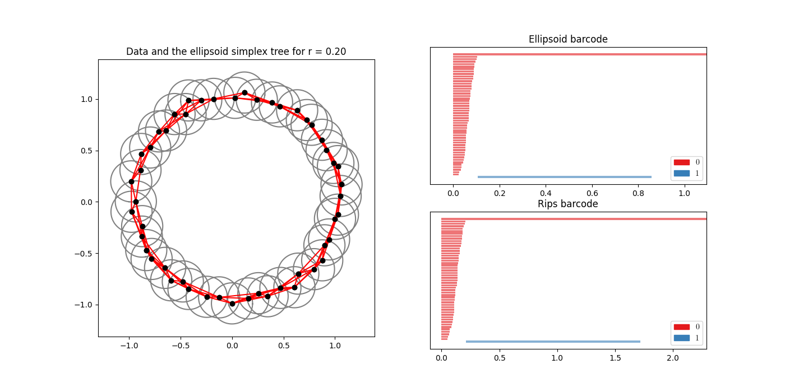

- 2:1
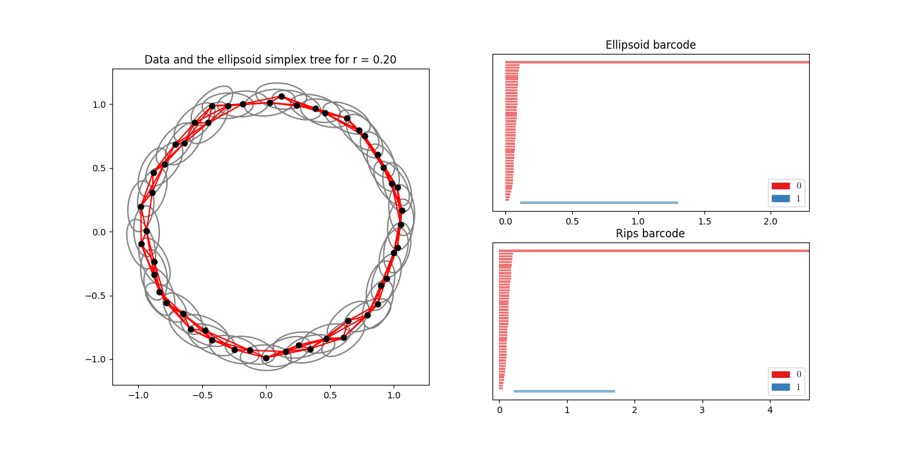

- 5:1
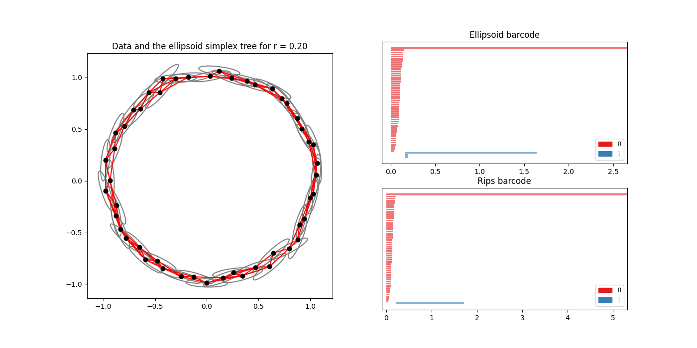

- 10:1
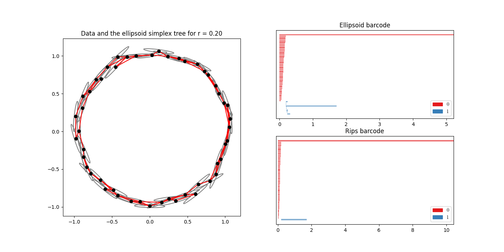


##### Sphere point cloud
- 1:1
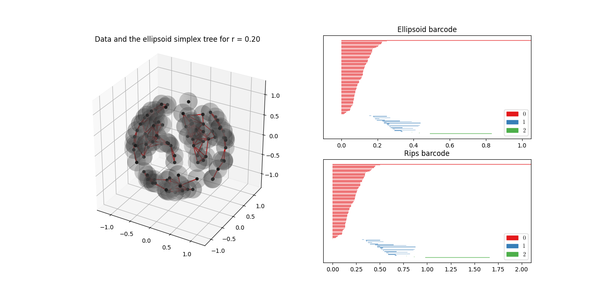

- 2:1
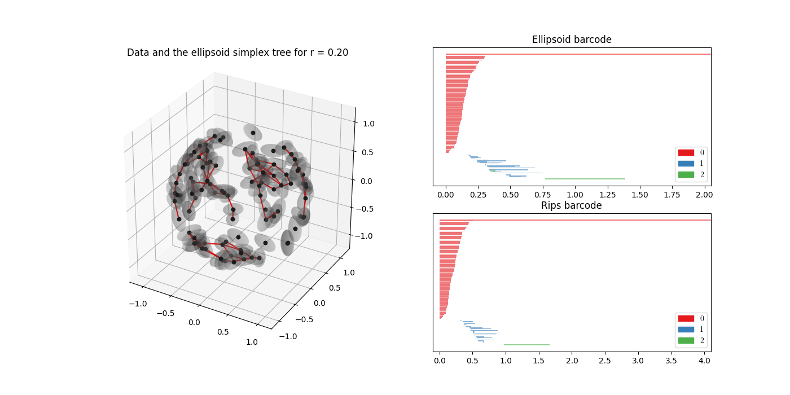

- 5:1
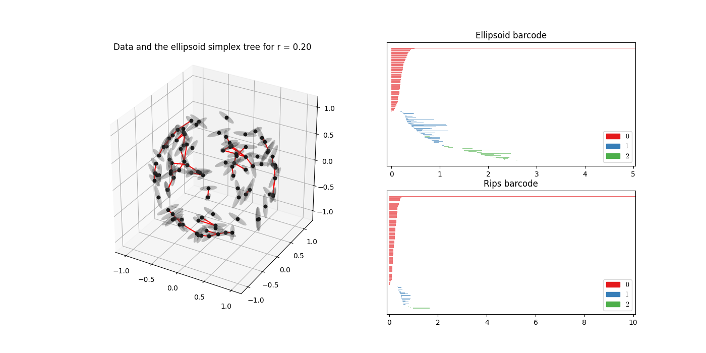


##### Figure eight point cloud
- 1:1
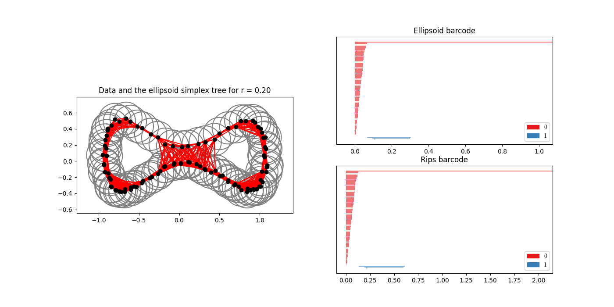

- 2:1
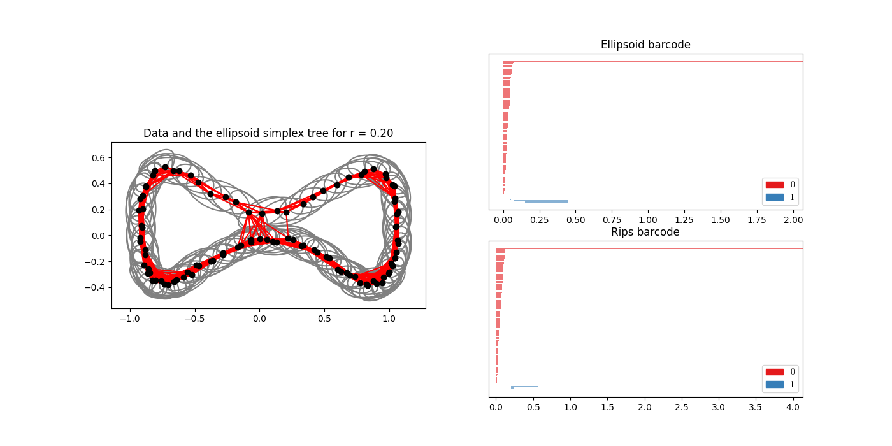

- 5:1
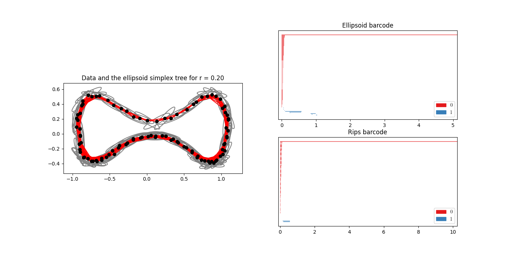

- 10:1
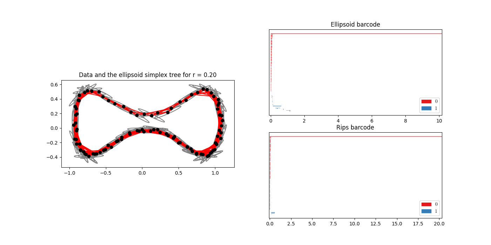


#### Speed

##### Circle, variation=0.2

| nPoints | EllpsoidsTime / RipsTime | Total time [s] | nbhdSize |
|---------|--------------------------|----------------|----------|
| 20      | 1007.7                   | 0.64           | 5        |
| 50      | 554.58                   | 4.15           | 5        |
| 100     | 306.33                   | 21.75          | 5        |

<!--
#### Bottleneck distance 
##### Bottleneck distance between ellipsoid and Rips complex
- without outliers -
[parameter values]

- with outliers

##### Bottleneck distance with vs without outliers (ellipsoid complex)


##### Bottleneck distance with vs without outliers (Rips complex)
-->


### Pending:
- calculate bottleneck distances if there are outliers and if not for both Rips and ellipsoid complexes for multiple examples

# Acknowledgements
- Kalisnik, Lesnik - [Finding the Homology of Manifolds using Ellipsoids (2020)](https://arxiv.org/abs/2006.09194) is the inspiration for this project.
- [GUDHI Library](https://gudhi.inria.fr/index.html) is used throughout the project. The file `barcodePlotting.py` is a slight modification of [this file](https://gudhi.inria.fr/python/latest/_modules/gudhi/persistence_graphical_tools.html#plot_persistence_barcode). <The modification makes it possible to specify the start and the end of x-axis.>
- The file `figure_eight.py` is courtesy of Bastian Rieck.
- The file `shapes.py` comes from [pytorch-topological](https://github.com/aidos-lab/pytorch-topological/blob/main/torch_topological/data/shapes.py).


