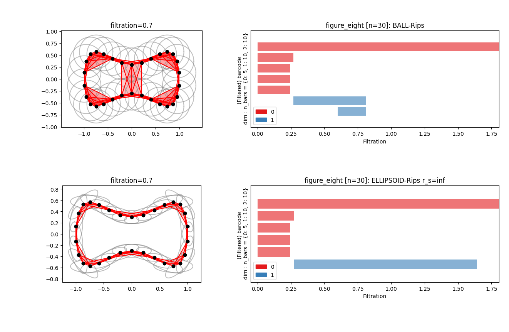
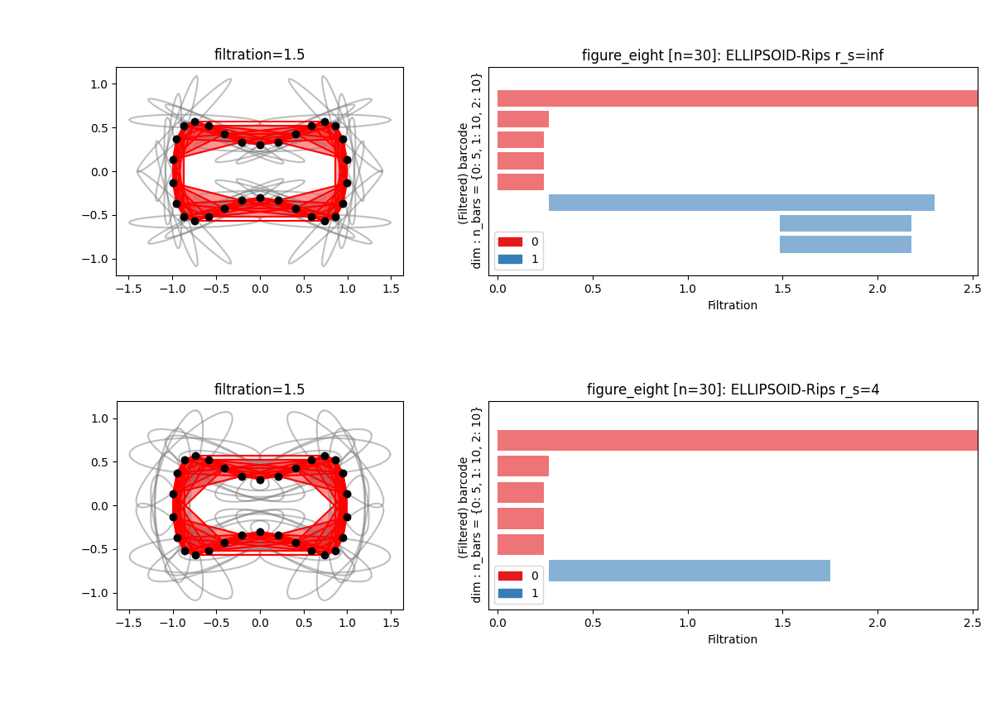

<div align="center">

  <h1 align="center">Ellipsoids</h3>

  <p align="center">
    Persistence homology of ellipsoid complexes
  </p>
</div>


<!-- TABLE OF CONTENTS -->
<details>
  <summary>Table of Contents</summary>
  <ol>
    <li><a href="#about-the-project">About The Project</a></li>
    <li><a href="#getting-started">Getting Started</a>
      <ul>
        <li><a href="#prerequisites">Prerequisites</a></li>
        <li><a href="#installation">Installation</a></li>
      </ul>
    </li>
    <li><a href="#usage">Usage and code organisation</a></li>
    <li><a href="#acknowledgments">Acknowledgments</a></li>
  </ol>
</details>

# About the project



This project contains the code used in the paper "Persistent Homology via Ellipsoids" [[1]](#1).

In the paper, we introduce a geometrically-informed simplicial complex, called the "ellipsoid complex". This complex is based on the idea that ellipsoids aligned with tangent directions better approximate the data compared to conventional (Euclidean) balls centered at sample points that are used in the construction of Rips and Alpha complexes, for instance.

The main goal of the project is to investigate properties of the ellipsoid complexes.

This repository contains modules for the generation of ellipsoid complexes, calculation of the corresponding barcodes, visualisation, as well as scripts for running experiments described in the paper. For more details on the code organisation, see the section on <a href="#usage">usage and code organisation</a> below.

> [!CAUTION]
>
> This project is currently undergoing a major overhaul. The version you're looking at is the most recent one and (hopefully) easier to use. If you're here to explore the code, I recommend using this version.
>
> This version isn't on the `main` branch yet because the scripts in `ellipsoids/scripts/turkevs`, which are used for running the experiments described in [[3]](#3), are still incomplete.
>
> Be aware that the old and new versions of the code are not compatible: experiment data generated with the old version won't work directly with this one. It may be possible to write conversion functions to bridge the two, but I don't plan to do that at this time.


# Getting started

At the moment, this code is only available on GitHub, at [https://github.com/a-zeg/ellipsoids](https://github.com/a-zeg/ellipsoids).

To run a simple example:
1. install the <a href="#prerequisites">prerequisites</a>;
2. download the project as a zip file from GitHub and unzip it;
3. navigate to the project root folder (so, `ellipsoids/` and **not** e.g. `ellipsoids/ellipsoids/` or `ellipsoids/scripts/`)
4. run `python scripts/example_0.py`.

This script creates a complex of `ELLIPSOID` type and `RIPS` subtype, calculates the corresponding barcode, saves the results to a JSON file, and plots them.


## Prerequisites

The dependencies are listed in [requirements.txt](./requirements.txt).

## Installation

Currently, the project can only be cloned or downloaded directly from GitHub; it is not available for installation via a package manager.


>[!TIP]
> To avoid the prerequisites clashing with whatever Python versions and packages you normally use, create an environment for this project using [pyenv](https://github.com/pyenv/pyenv) or a similar environment management solution.


# Usage and project organisation

To run an experiment, one has to create an object of the Experiment class.
Such an object consists of:
 - a `Dataset` object, containing points, a name (`data_type`) and possibly some additional information;
 - a `Parameters` object, containing all the parameters needed to run the experiment. One can choose the complex type (`BALL` or `ELLIPSOID`), subtype (`RIPS` or `ALPHA`), expansion dimension, whether simplex tree should be saved, etc).
 - a `Results` (or `EllipsoidResults`, depending on the complex type chosen) object, containing the computed barcode, simplex tree, execution time, and possibly ellipsoid list.
 - a `PlotParameters` object, containing the parameters needed to perform the plotting.

Slightly more complicated example that involves plotting results of multiple experiments in the same figure (and whose output can be seen on the top of this page) can be run with:

```
python scripts/example_1.py
```


## Project organisation

All scripts from `ellipsoids/scripts/` are made to be run from the project root directory.

Below is an overview of the project folders.

| Folder | Description |
| -------- | ------- |
| `data/` | Default results output location. |
| `datasets/` | Datasets, including pentagons and cyclo-octane. |
| `ellipsoids/` | Modules for: generating ellipsoid complexes and calculating barcodes, visualisation, handling data, and running classification experiments developed in [2]. |
| `images/` | Images for this README. |
| `scripts/` | Scripts that can be used to run experiments. |


### Different (sub)types of complexes

The user can choose a number of different complex types and subtypes by choosing the values of`Parameters` or `EllipsoidParameters` object.
For more details on the supported complex types, see the table below.

| Complex type | Description | Supported in |
|--------------|-----------------|-----------------|
| `BALL` | Constructed by calculating intersections of balls | `Parameters` |
| `ELLIPSOID` | Constructed by analysing intersections of ellipsoids | `EllipsoidParameters` |

For more details on the supported complex subtypes, see the following table.

| Complex subtype | Description | Supported in | Remark |
|-----------------|-------------|--------------| -- |
| `RIPS` | Constructed by calculating pairwise intersections of all balls or ellipsoids (depending on the complex type) | `Parameters` or `EllipsoidParameters` |  |
| `ALPHA` | Constructed by calculating intersections of balls or ellipsoids (depending on the complex type) centered at adjacent vertexes in the Delaunay triangulation. | `Parameters` or `EllipsoidParameters` | The filtrations in `ELLIPSOID`-`ALPHA` complexes are scaled to match the filtrations from Alpha complexes calculated using GUDHI.

> [!WARNING]
> Note that in the case of ellipsoids, only intersections between pairs of ellipsoids are taken into account. The higher order intersections (such as the ones used in GUDHI when calculating alpha complexes) are ignored.
 
 
#### Spherisized ELLIPSOID complex

In both `ELLIPSOID-RIPS` and `ELLIPSOID-ALPHA` complexes, it is possible to, instead of ellipsoids with fixed axes ratios, work with ellipsoids that start off with the specified axes ratios and then linearly turn into spheres at a specified filtration set by the variable`r_spherisize` in `EllipsoidParameters`.

In some datasets, especially if very elongated ellipsoids are used, this construction can prevent unwanted cycles. Below is a comparison between an ellipsoid that has fixed axes ratio of 10:1 and one that starts off with axes ratio 10:1, but turns into a sphere as it grows large enough.



The code used to generate this plot is in `ellipsoids/scripts/example_2.py`.


# TODOs

The code has changed a lot since the last version and not everything works yet.

On my TODO list are:
- rewrite stuff in `ellipsoids/scripts/turkevs` and re-run all experiments;
- test plotting more thoroughly;
- clean up unused code;
- update tests.

If you spot any blunders or if you're trying to use the code and you can't find your way around, please contact me: ana [dot] zegarac [at] math [dot] ethz [dot] ch.


# Acknowledgements

The last co-author of the paper [[1]](#1) would like to thank:
- Marco Gähler for running the Code Review Days at ETH Zurich, for taking the time to read through multiple versions of the code, and for his tips on testing and improving code readability.
- Jan Schüssler for his help with parallelisation and Python paths.

The paper in its current form would not be possible without the following papers, libraries, and datasets.

- Theoretical results from the work of Kališnik and Lešnik [[2]](#2) were the inspiration for this project.
- [GUDHI Library](https://gudhi.inria.fr/index.html) is used throughout the project. The function `plot_barcode` in `visualisation.py` is an adapted version the function `plot_persistence_barcode` from [this file](https://gudhi.inria.fr/python/latest/_modules/gudhi/persistence_graphical_tools.html#plot_persistence_barcode).
- The code in `ellipsoids/turkevs` was borrowed (with small modifications) from [https://github.com/renata-turkes/turkevs2022on](https://github.com/renata-turkes/turkevs2022on).
- The cyclo-octane dataset was obtained from the JavaPlex library in MATLAB.
- The pentagons dataset was created by Clayton Shonkwiler and provided to us by Henry Adams.
- The function `create_annulus` in `data_handling.py` was borrowed from [pytorch-topological](https://github.com/aidos-lab/pytorch-topological/blob/main/torch_topological/data/shapes.py).


# References

<a id="1">[1]</a> 
S. Kališnik, B. Rieck and A. Žegarac.
"Persistent Homology via Ellipsoids".

<a id="2">[2]</a>
S. Kališnik and D. Lešnik. 
"Finding the homology of manifolds using ellipsoids". 
In: Journal of Applied and Computational Topology 8.1 (Mar. 2024), pp. 193–238. doi: 10.1007/s41468-023- 00145-6.


<a id="3">[3]</a> 
R.Turkeš, G.F.Montúfar, and N.Otter. 
"On the Effectiveness of Persistent Homology”. 
In: Advances in Neural Information Processing Systems. Ed. by S. Koyejo et al. Vol. 35. Curran Associates, Inc., 2022, pp. 35432–35448.
